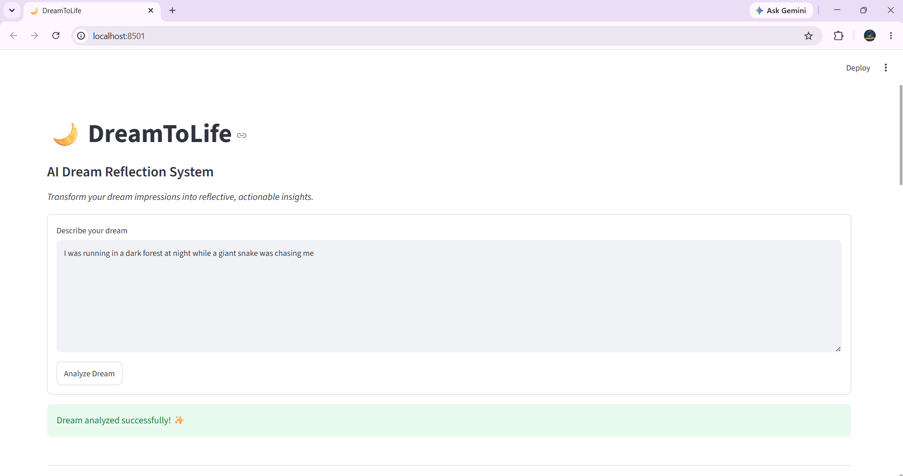
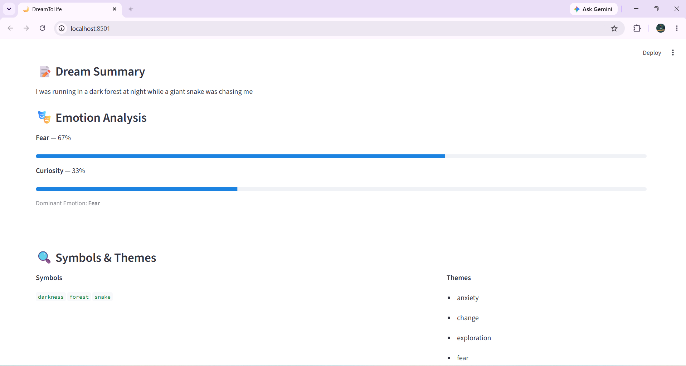
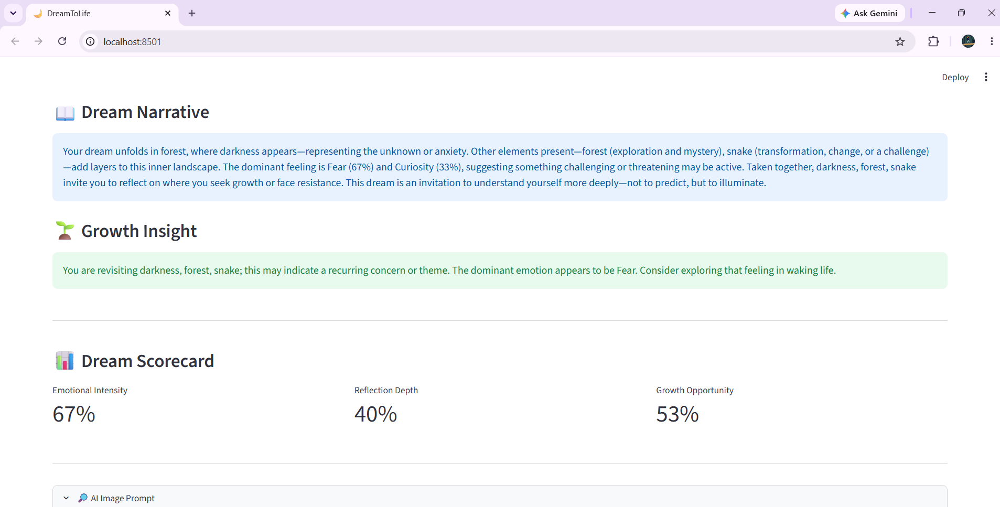
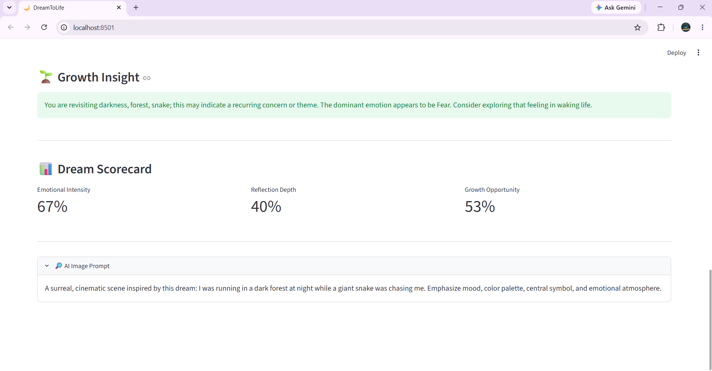

# 🌙 DreamToLife

> Transform your dream impressions into reflective, actionable insights.

DreamToLife is a beginner-friendly Python multi-agent system that helps 
users reflect on their dreams and convert subconscious patterns into 
actionable personal-growth insights. It is explicitly NOT fortune-telling.


## ✨ Features
- 🎭 Emotion analysis with intensity scores
- 🔍 Symbol detection (50+ symbols knowledge base)
- 📋 Action suggestions (daily + weekly + reflection questions)
- 📈 Growth tracking across multiple dreams
- 💾 JSON-based dream journal (`dream_journal.json`)
- 🖼️ AI image prompt generator


## Tech Stack
- Python
- Streamlit (web UI)
- Built with GitHub Copilot (VS Code)


## 📸 Screenshots










## Run Locally
```bash
pip install streamlit
streamlit run app.py
```


## 🎥 Demo Video  

Watch the full walkthrough of DreamToLife in action:  

[▶️ Demo Video on YouTube](https://youtu.be/smmODQzJJ6Y?feature=shared)  

In this demo, you’ll see:  
- How DreamToLife analyzes a dream input  
- Emotion, Symbol, Action, and Growth Agents working together  
- The generated Dream Report with Growth Insight and Scorecard  
- Future roadmap and vision for expansion  


## Architecture Overview

```text
User Input
    │
    ▼
CoordinatorAgent
    ├── EmotionAgent → Emotion Analysis
    ├── SymbolAgent  → Symbols & Themes
    ├── ActionAgent  → Reflection & Actions
    └── GrowthAgent  → Growth Insights
                │
                ▼
       DreamToLife Report
```

## 🏆 Built for
Agents League Hackathon — Creative Apps Track  
Microsoft Innovation Studio, June 2026
